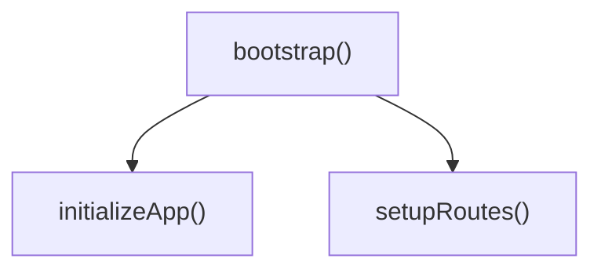

# Call Structure TS

[](https://badge.fury.io/js/call-structure-ts)
[](https://opensource.org/licenses/MIT)
[](https://nodejs.org/)

A powerful TypeScript command-line tool for analyzing function call structures, visualizing call graphs, and validating code architecture in TypeScript projects.

## ✨ Features

- **🔍 Static Analysis**: Analyze TypeScript codebases to understand function call relationships
- **📊 Multiple Output Formats**: Generate results in JSON, YAML, and Mermaid diagram formats
- **✅ Structure Validation**: Test your code structure against specifications
- **⚡ Performance Optimized**: File-based caching, parallel processing, and incremental analysis
- **🔄 Interactive Mode**: User-friendly interactive interface for analysis
- **📦 Batch Processing**: Analyze multiple entry points simultaneously
- **🎯 Entry Point Discovery**: Automatically find controllers, handlers, and main functions
- **🔧 Configurable**: Flexible configuration options for different project needs

## 🚀 Quick Start

### Installation

```bash
# Install globally
npm install -g call-structure-ts

# Or install locally
npm install --save-dev call-structure-ts
```

### Basic Usage

```bash
# Analyze a function and output to console
call-structure analyze --entry "src/main.ts#bootstrap"

# Generate a Mermaid diagram
call-structure analyze --entry "src/api/routes.ts#setupRoutes" --format mermaid --output routes.mmd

# Interactive mode
call-structure interactive

# Discover entry points
call-structure discover --exported --controllers
```

## 📖 Documentation

### Installation Guide

#### Prerequisites

- Node.js 22.0.0 or higher
- TypeScript project with `tsconfig.json`

#### Global Installation

```bash
npm install -g call-structure-ts
```

#### Local Installation

```bash
# Install as development dependency
npm install --save-dev call-structure-ts

# Use with npx
npx call-structure analyze --entry "src/main.ts#main"
```

#### From Source

```bash
git clone https://github.com/hidenorigoto/call-structure-ts.git
cd call-structure-ts
npm install
npm run build
npm link
```

### CLI Commands

#### `analyze` - Analyze Call Graph

Analyze call graph from a specific entry point.

```bash
call-structure analyze --entry "src/main.ts#bootstrap" [options]
```

**Options:**

- `--entry, -e <entry>` - Entry point (required): `"path/to/file.ts#functionName"` or `"path/to/file.ts#ClassName.methodName"`
- `--output, -o <file>` - Output file path
- `--format, -f <format>` - Output format: `json`, `yaml`, `mermaid` (default: `json`)
- `--max-depth, -d <depth>` - Maximum analysis depth (default: `10`)
- `--include-node-modules` - Include node_modules in analysis
- `--include-tests` - Include test files in analysis
- `--exclude <patterns...>` - Exclude patterns (regex)
- `--include <patterns...>` - Include patterns (regex)
- `--no-callbacks` - Skip callback function analysis
- `--metrics` - Include analysis metrics
- `--tsconfig <path>` - Path to tsconfig.json
- `--project-root <path>` - Project root directory (default: `.`)
- `--filter-external` - Exclude external library calls
- `--parallel <n>` - Number of parallel workers
- `--cache <dir>` - Cache directory for incremental analysis
- `--config <file>` - Load options from configuration file

**Examples:**

```bash
# Basic analysis
call-structure analyze --entry "src/app.ts#main"

# With output file and format
call-structure analyze --entry "src/server.ts#startServer" --format mermaid --output server.mmd

# With depth limit and caching
call-structure analyze --entry "src/complex.ts#process" --max-depth 5 --cache .cache

# Exclude test files
call-structure analyze --entry "src/main.ts#bootstrap" --exclude "**/*.test.ts" --exclude "**/mocks/**"
```

#### `discover` - Discover Entry Points

Find potential entry points in your project.

```bash
call-structure discover [options]
```

**Options:**

- `--pattern, -p <patterns...>` - File patterns to search (regex)
- `--controllers` - Find controller methods
- `--handlers` - Find handler functions
- `--main` - Find main functions
- `--exported` - Find exported functions
- `--output, -o <file>` - Output file path
- `--format, -f <format>` - Output format: `json`, `yaml` (default: `json`)
- `--tsconfig <path>` - Path to tsconfig.json
- `--project-root <path>` - Project root directory (default: `.`)

**Examples:**

```bash
# Find all entry points
call-structure discover

# Find controllers and handlers
call-structure discover --controllers --handlers

# Find exported functions and save to file
call-structure discover --exported --output entry-points.json
```

#### `analyze-batch` - Batch Analysis

Analyze multiple entry points from a configuration file.

```bash
call-structure analyze-batch --config batch-config.yaml [options]
```

**Options:**

- `--config <file>` - Batch configuration file (required)
- `--output-dir <dir>` - Output directory (default: `./results`)
- `--parallel <n>` - Number of parallel analyses (default: `4`)
- `--continue-on-error` - Continue if an analysis fails

**Example:**

```bash
call-structure analyze-batch --config batch-config.yaml --parallel 8 --output-dir ./analysis-results
```

#### `validate` - Validate Entry Points

Validate that entry points exist and are accessible.

```bash
call-structure validate --entry "src/main.ts#bootstrap" [options]
```

**Options:**

- `--entry, -e <entry>` - Entry point to validate (required)
- `--tsconfig <path>` - Path to tsconfig.json
- `--project-root <path>` - Project root directory (default: `.`)

#### `test` - Test Against Specifications

Test your code structure against predefined specifications.

```bash
call-structure test --spec expected-structure.yaml [options]
```

**Options:**

- `--spec <file>` - Test specification file (YAML or Mermaid) (required)
- `--target <dir>` - Target directory to analyze (default: `src/`)
- `--format <type>` - Output format: `text`, `json` (default: `text`)
- `--tsconfig <path>` - Path to tsconfig.json
- `--project-root <path>` - Project root directory (default: `.`)
- `--max-depth, -d <depth>` - Maximum analysis depth (default: `10`)
- `--verbose, -v` - Show detailed error information

#### `interactive` - Interactive Mode

Launch interactive mode for guided analysis.

```bash
call-structure interactive [options]
```

**Options:**

- `--tsconfig <path>` - Path to tsconfig.json
- `--project-root <path>` - Project root directory (default: `.`)

### Configuration

#### Configuration File

Create a `.call-structure.yaml` file in your project root:

```yaml
# Project settings
projectRoot: '.'
tsconfig: 'tsconfig.json'

# Analysis settings
maxDepth: 10
includeNodeModules: false
includeTests: false

# Exclude patterns
exclude:
  - '**/*.test.ts'
  - '**/*.spec.ts'
  - '**/node_modules/**'
  - '**/dist/**'

# Include patterns
include:
  - 'src/**/*.ts'
  - 'lib/**/*.ts'

# Output settings
output:
  format: 'json'
  includeMetadata: true
  includeMetrics: false
  prettify: true

# Performance settings
performance:
  enableCache: true
  cacheDir: '.call-structure-cache'
  enableParallel: true
  concurrency: 4
  enableIncremental: true

# Filter settings
filterExternal: true
includeCallbacks: true
```

#### Batch Configuration

Create a batch configuration file for analyzing multiple entry points:

```yaml
# batch-config.yaml
projectRoot: '.'
tsconfig: 'tsconfig.json'
maxDepth: 10
includeMetrics: true

entry_points:
  - file: 'src/controllers/UserController.ts'
    function: 'createUser'
    output: 'user-create.json'
    format: 'json'
  - file: 'src/controllers/UserController.ts'
    function: 'updateUser'
    output: 'user-update.mmd'
    format: 'mermaid'
  - file: 'src/services/AuthService.ts'
    function: 'login'
    className: 'AuthService'
    output: 'auth-login.yaml'
    format: 'yaml'
    maxDepth: 5

analysisOptions:
  includeMetrics: true
  filterExternal: true
```

### API Usage

#### Basic Analysis

```typescript
import { CallGraphAnalyzer } from 'call-structure-ts';

const analyzer = new CallGraphAnalyzer('./tsconfig.json');
const graph = await analyzer.analyzeFromEntryPoint('src/main.ts#bootstrap');

console.log('Functions:', graph.nodes.size);
console.log('Calls:', graph.edges.length);
```

#### With Performance Optimization

```typescript
import { PerformanceOptimizer } from 'call-structure-ts';

// Create optimizer with default settings
const optimizer = PerformanceOptimizer.createDefault('./tsconfig.json');

// Analyze with optimizations
const result = await optimizer.analyze('src/index.ts#main');
```

#### Custom Configuration

```typescript
import { CallGraphAnalyzer, ProjectContext } from 'call-structure-ts';

const context: ProjectContext = {
  rootPath: './src',
  tsConfigPath: './tsconfig.json',
  packageJsonPath: './package.json',
  sourcePatterns: ['src/**/*.ts'],
  excludePatterns: ['**/*.test.ts', 'node_modules/**'],
};

const analyzer = new CallGraphAnalyzer(context, {
  maxDepth: 15,
  includeNodeModules: false,
  includeTests: false,
});

const graph = await analyzer.analyzeFromEntryPoint('src/app.ts#main');
```

## 📁 Example Projects

The `examples/` directory contains comprehensive examples demonstrating various use cases:

### [Simple Project](examples/simple-project/)

Basic TypeScript project demonstrating fundamental analysis features.

### [Async Patterns](examples/async-patterns/)

Examples of analyzing asynchronous code patterns including Promises and async/await.

### [Circular Dependencies](examples/circular-deps/)

Demonstrates circular dependency detection and resolution strategies.

### [Domain-Driven Design](examples/ddd-example/)

Complete DDD architecture example with layers, aggregates, and use cases.

### [Express.js API](examples/express-api/)

REST API with authentication, middleware, and service layers.

### [React Application](examples/react-app/)

Modern React app with hooks, state management (Zustand), and React Query.

### [NestJS Application](examples/nestjs-app/)

Enterprise NestJS application with decorators, dependency injection, and modules.

### [Performance Optimization](examples/performance-optimization/)

Advanced techniques for analyzing large codebases with caching and parallel processing.

## 🎯 Use Cases

### 1. Express.js Application Analysis

```bash
# Analyze server startup
call-structure analyze --entry "src/server.ts#startServer" --format mermaid --output server-flow.mmd

# Analyze specific route handler
call-structure analyze --entry "src/routes/users.ts#createUser" --max-depth 8
```

### 2. Microservice Architecture

```yaml
# microservice-analysis.yaml
entry_points:
  - file: 'src/auth/AuthController.ts'
    function: 'authenticate'
    output: 'auth-flow.json'
  - file: 'src/users/UserService.ts'
    function: 'createUser'
    output: 'user-creation.json'
  - file: 'src/orders/OrderProcessor.ts'
    function: 'processOrder'
    output: 'order-processing.mmd'
    format: 'mermaid'
```

```bash
call-structure analyze-batch --config microservice-analysis.yaml
```

### 3. Code Architecture Validation

```yaml
# expected-structure.yaml
entryPoint:
  file: 'src/main.ts'
  function: 'bootstrap'

expectedStructure:
  - from: 'bootstrap'
    to: 'initializeDatabase'
  - from: 'bootstrap'
    to: 'setupMiddleware'
  - from: 'bootstrap'
    to: 'startServer'
  - from: 'initializeDatabase'
    to: 'connectToMongoDB'
```

```bash
call-structure test --spec expected-structure.yaml
```

### 4. Performance Analysis

```bash
# Analyze with performance metrics
call-structure analyze --entry "src/heavy-process.ts#processLargeDataset" --metrics --cache .cache

# Use performance optimizer
call-structure analyze --entry "src/main.ts#main" --parallel 8 --cache .performance-cache
```

## 🔧 Advanced Features

### Performance Optimization

The tool includes several performance optimization features:

- **File-based Caching**: Avoid re-analyzing unchanged files
- **Parallel Processing**: Analyze multiple files simultaneously
- **Incremental Analysis**: Only analyze changed files
- **AST Optimization**: Skip uninteresting nodes during traversal

Enable with:

```bash
call-structure analyze --entry "src/main.ts#main" --cache .cache --parallel 8
```

### Interactive Mode

Launch interactive mode for guided analysis:

```bash
call-structure interactive
```

Features:

- File and function selection with autocomplete
- Real-time analysis preview
- Multiple output format options
- Batch configuration creation

## 📊 Output Formats

### JSON Format

```json
{
  "metadata": {
    "entryPoint": "src/main.ts#bootstrap",
    "timestamp": "2024-01-01T00:00:00.000Z",
    "version": "1.0.0"
  },
  "nodes": [
    {
      "id": "bootstrap",
      "name": "bootstrap",
      "filePath": "src/main.ts",
      "type": "function"
    }
  ],
  "edges": [
    {
      "from": "bootstrap",
      "to": "initializeApp",
      "type": "call"
    }
  ]
}
```

### YAML Format

```yaml
metadata:
  entryPoint: 'src/main.ts#bootstrap'
  timestamp: '2024-01-01T00:00:00.000Z'
  version: '1.0.0'

nodes:
  - id: 'bootstrap'
    name: 'bootstrap'
    filePath: 'src/main.ts'
    type: 'function'

edges:
  - from: 'bootstrap'
    to: 'initializeApp'
    type: 'call'
```

### Mermaid Format



## 🚨 Troubleshooting

### Common Issues

#### Entry Point Not Found

**Error**: `Entry point not found: src/main.ts#bootstrap`

**Solutions**:

- Verify the file path is correct relative to project root
- Ensure the function is exported
- Check TypeScript compilation errors
- Use `call-structure validate --entry "src/main.ts#bootstrap"` to verify

#### Performance Issues

**Symptoms**: Slow analysis, high memory usage

**Solutions**:

- Enable caching: `--cache .cache`
- Limit analysis depth: `--max-depth 5`
- Exclude test files: `--exclude "**/*.test.ts"`
- Use parallel processing: `--parallel 4`

#### TypeScript Compilation Errors

**Error**: `Cannot find module 'src/types'`

**Solutions**:

- Ensure `tsconfig.json` is properly configured
- Check path mapping in TypeScript configuration
- Verify all dependencies are installed
- Use `--tsconfig` to specify correct config file

#### Large Codebase Issues

**Symptoms**: Out of memory, slow performance

**Solutions**:

- Enable incremental analysis with caching
- Increase Node.js memory limit: `NODE_OPTIONS="--max-old-space-size=4096"`
- Use batch processing for multiple entry points
- Exclude node_modules: `--exclude "**/node_modules/**"`

### Debug Mode

Enable debug logging for troubleshooting:

```bash
call-structure analyze --entry "src/main.ts#main" --debug
```

## 🤝 Contributing

We welcome contributions! Please see our [Contributing Guide](CONTRIBUTING.md) for details.

### Development Setup

```bash
# Clone the repository
git clone https://github.com/hidenorigoto/call-structure-ts.git
cd call-structure-ts

# Install dependencies
npm install

# Build the project
npm run build

# Run tests
npm test

# Run linting
npm run lint

# Link for local development
npm link
```

### Git Hooks

This project uses Husky for Git hooks:

- **Pre-commit**: Runs linting, formatting, type checking, and tests
- **Commit-msg**: Enforces conventional commit format
- **Pre-push**: Runs comprehensive verification

### Project Structure

```
call-structure-ts/
├── src/
│   ├── analyzer/          # Core analysis engine
│   ├── cli/              # Command-line interface
│   ├── formatter/        # Output formatters
│   ├── parser/           # Mermaid parsing
│   ├── performance/      # Performance optimizations
│   ├── types/           # Type definitions
│   └── utils/           # Utility functions
├── tests/
│   ├── unit/            # Unit tests
│   ├── integration/     # Integration tests
│   └── fixtures/        # Test fixtures
├── docs/               # Documentation
├── examples/           # Example projects
│   ├── simple-project/          # Basic TypeScript project
│   ├── async-patterns/          # Async/await patterns
│   ├── circular-deps/           # Circular dependency detection
│   ├── ddd-example/            # Domain-Driven Design architecture
│   ├── express-api/            # Express.js REST API
│   ├── react-app/              # React application with hooks
│   ├── nestjs-app/             # NestJS enterprise application
│   └── performance-optimization/ # Performance optimization techniques
└── benchmarks/         # Performance benchmarks
```

## 📄 License

This project is licensed under the MIT License - see the [LICENSE](LICENSE) file for details.

## 📚 Additional Resources

- [Architecture Documentation](docs/ARCHITECTURE.md)
- [Performance Guide](docs/performance.md)
- [Testing Guide](docs/testing.md)
- [Git Hooks Documentation](docs/git-hooks.md)

## 🏗️ Roadmap

- [ ] VS Code extension
- [ ] Plugin system for custom analyzers
- [ ] Watch mode for continuous analysis
- [ ] Web-based visualization
- [ ] Integration with popular CI/CD platforms

---

Made with ❤️ by the Call Structure TS team
