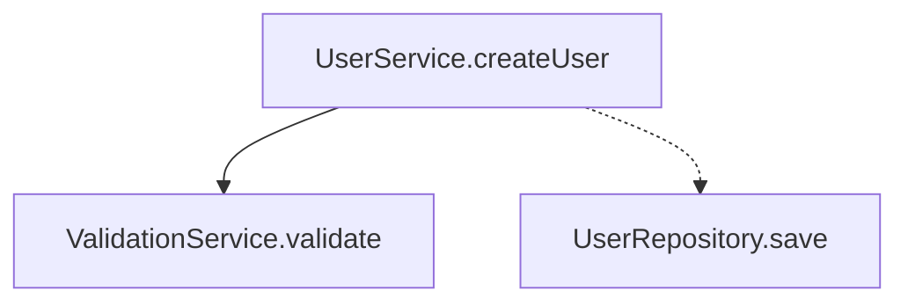
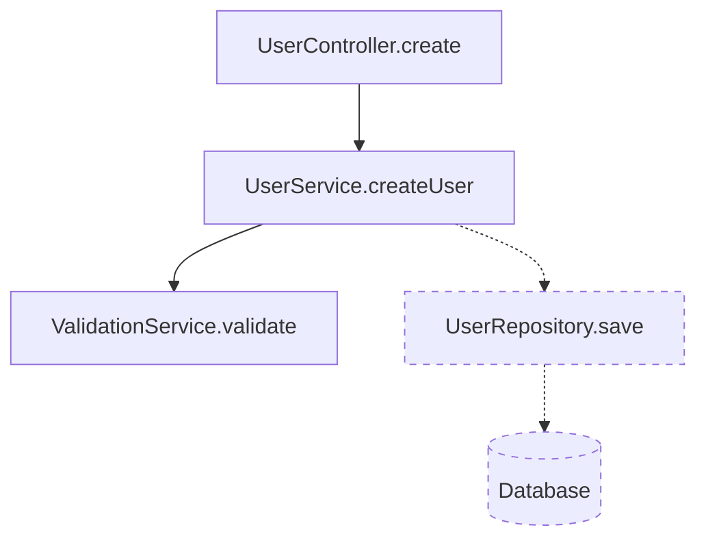

# Call Structure TS - アーキテクチャドキュメント

## 1. プロジェクト概要

Call Structure TSは、TypeScriptプロジェクトの関数呼び出し構造を静的解析し、特定のエントリーポイントからのコールグラフを生成するコマンドラインツールです。

### 主要機能
- エントリーポイントからの関数呼び出し追跡
- コールグラフの構造化データ出力（JSON/YAML/Mermaid）
- 期待される呼び出し構造との比較・検証

## 2. 技術スタック

### コア技術
- **TypeScript**: 開発言語
- **ts-morph**: TypeScript Compiler API wrapper（AST解析）
- **Chevrotain**: Mermaidパーサー実装用
- **Commander**: CLIフレームワーク

### 出力形式
- **JSON**: 機械処理用の主要形式
- **YAML**: 人間可読性重視（js-yaml使用）
- **Mermaid**: 視覚化・ドキュメント用

## 3. アーキテクチャ概要

```
┌─────────────────┐
│      CLI        │
│  (Commander)    │
└────────┬────────┘
         │
┌────────▼────────┐
│   Analyzer      │
│   (ts-morph)    │
└────────┬────────┘
         │
┌────────▼────────┐     ┌──────────────┐
│  Call Graph     │────▶│  Formatters  │
│  Data Model     │     │ (JSON/YAML/  │
└─────────────────┘     │  Mermaid)    │
                        └──────────────┘
```

## 4. ディレクトリ構造

```
call-structure-ts/
├── src/
│   ├── analyzer/
│   │   ├── CallGraphAnalyzer.ts      # メイン解析エンジン
│   │   ├── EntryPointAnalyzer.ts     # エントリーポイント解析
│   │   └── StructureValidator.ts     # 構造検証
│   ├── parser/
│   │   ├── MermaidLexer.ts           # Mermaidトークナイザー
│   │   ├── MermaidParser.ts          # Mermaidパーサー
│   │   └── MermaidVisitor.ts         # AST変換
│   ├── formatter/
│   │   ├── JsonFormatter.ts          # JSON出力
│   │   ├── YamlFormatter.ts          # YAML出力
│   │   └── MermaidFormatter.ts       # Mermaid出力
│   ├── cli/
│   │   └── index.ts                  # CLIエントリーポイント
│   ├── types/
│   │   └── CallGraph.ts              # 型定義
│   └── utils/
│       └── logger.ts                 # ユーティリティ
├── tests/
├── docs/
└── examples/
```

## 5. コアコンポーネント

### 5.1 CallGraphAnalyzer
ts-morphを使用してTypeScriptのASTを解析し、関数呼び出しを抽出する中核コンポーネント。

#### 責務
- TypeScriptプロジェクトの読み込み
- AST解析による関数呼び出しの抽出
- 呼び出しグラフの構築

#### 主要機能
- 関数宣言、メソッド、アロー関数の解析
- 同期/非同期呼び出しの識別
- 外部ライブラリ呼び出しの除外

### 5.2 EntryPointAnalyzer
指定されたエントリーポイントから開始して、呼び出しチェーンを追跡する。

#### 責務
- エントリーポイントの特定
- 深さ優先探索による呼び出し追跡
- 循環参照の検出

### 5.3 MermaidParser（Chevrotain使用）
Mermaid形式のテスト仕様を解析し、期待される呼び出し構造を抽出する。

#### 実装方針
- Chevrotainによる堅牢なパーサー実装
- エラー回復機能
- 高速な解析処理

### 5.4 StructureValidator
実際のコールグラフと期待される構造を比較し、違いを報告する。

#### 責務
- 必須呼び出しの存在確認
- 禁止呼び出しの検出
- 差分レポートの生成

## 6. データモデル

### 6.1 内部表現（TypeScript）
```typescript
interface CallGraph {
  meta: {
    generated_at: string;
    entry_point: string;
  };
  nodes: CallNode[];
  edges: CallEdge[];
}

interface CallNode {
  id: string;
  name: string;
  file: string;
  type: 'function' | 'method' | 'arrow';
  async: boolean;
}

interface CallEdge {
  from: string;
  to: string;
  type: 'sync' | 'async' | 'callback';
}
```

### 6.2 出力形式

#### JSON（機械処理用）
```json
{
  "meta": {
    "generated_at": "2025-01-12T10:00:00Z",
    "entry_point": "UserService.createUser"
  },
  "nodes": [...],
  "edges": [...]
}
```

#### Mermaid（視覚化用）


## 7. 処理フロー

### 7.1 解析フロー
1. CLIコマンド受付
2. TypeScriptプロジェクト読み込み（tsconfig.json）
3. エントリーポイント特定
4. AST解析による呼び出し抽出
5. コールグラフ構築
6. 指定形式での出力

### 7.2 検証フロー
1. テスト仕様読み込み（YAML/Mermaid）
2. 実際のコールグラフ生成
3. 構造比較
4. 差分レポート出力

## 8. 拡張性

### 8.1 新しい出力形式の追加
Formatterインターフェースを実装することで、新しい出力形式を追加可能。

### 8.2 解析機能の拡張
- より複雑な呼び出しパターンの対応
- メトリクス分析の追加
- パフォーマンス最適化

## 9. パフォーマンス考慮事項

### 9.1 最適化戦略
- インクリメンタル解析
- 結果のキャッシング
- 大規模プロジェクト対応（並列処理）

### 9.2 制限事項
- 動的な関数呼び出しは解析不可
- 実行時の条件分岐は考慮外
- 外部ライブラリの深い解析は対象外

## 10. セキュリティ考慮事項

- ファイルシステムアクセスは読み取りのみ
- 外部ネットワークアクセスなし
- ユーザー入力の適切なバリデーション

## 11. コマンド利用方法

### 11.1 基本的な解析コマンド

#### エントリーポイントからの解析（JSON出力）
```bash
call-structure analyze --entry "src/services/UserService.ts#createUser" --output result.json
```

**説明**: `UserService.ts`の`createUser`関数をエントリーポイントとして解析し、結果をJSON形式で出力します。

**出力例**:
```json
{
  "meta": {
    "generated_at": "2025-01-12T10:00:00Z",
    "entry_point": "UserService.createUser",
    "max_depth": 10
  },
  "nodes": [
    {
      "id": "UserService.createUser",
      "name": "createUser",
      "file": "src/services/UserService.ts",
      "type": "method",
      "async": true
    },
    {
      "id": "ValidationService.validate",
      "name": "validate",
      "file": "src/services/ValidationService.ts",
      "type": "method",
      "async": false
    }
  ],
  "edges": [
    {
      "from": "UserService.createUser",
      "to": "ValidationService.validate",
      "type": "sync"
    },
    {
      "from": "UserService.createUser",
      "to": "UserRepository.save",
      "type": "async"
    }
  ]
}
```

#### YAML形式での出力
```bash
call-structure analyze --entry "src/api/users.ts#handleCreateUser" --format yaml --output result.yaml
```

**説明**: YAML形式で人間が読みやすい形式で出力します。

**出力例**:
```yaml
meta:
  generated_at: "2025-01-12T10:00:00Z"
  entry_point: "handleCreateUser"
  
nodes:
  - id: "handleCreateUser"
    name: "handleCreateUser"
    file: "src/api/users.ts"
    type: "function"
    async: true
    
edges:
  - from: "handleCreateUser"
    to: "UserController.create"
    type: "async"
```

#### Mermaid図の生成
```bash
call-structure analyze --entry "src/controllers/UserController.ts#UserController.create" --format mermaid --output diagram.mmd
```

**説明**: GitHubやGitLabで直接表示可能なMermaid形式で出力します。

**出力例**:


### 11.2 構造検証コマンド

#### YAML仕様での検証
```bash
call-structure test --spec expected-structure.yaml --target src/
```

**説明**: 期待される呼び出し構造と実際のコードを比較し、差分を報告します。

**仕様ファイル例** (`expected-structure.yaml`):
```yaml
entry_point: "UserService.createUser"
required_edges:
  - from: "UserService.createUser"
    to: "ValidationService.validate"
    type: "sync"
  - from: "UserService.createUser"
    to: "UserRepository.save"
    type: "async"
    
forbidden_edges:
  - from: "UserService.createUser"
    to: "DirectDatabaseAccess.query"
```

**出力例**:
```
✓ All required edges found
✗ Forbidden edge detected: UserService.createUser -> DirectDatabaseAccess.query

Summary:
- Required edges: 2/2 ✓
- Forbidden edges: 1 found ✗
- Test FAILED
```

#### Mermaid仕様での検証
```bash
call-structure test --spec expected.mmd --target src/
```

**仕様ファイル例** (`expected.mmd`):
```mermaid
flowchart TD
    UserService.createUser --> ValidationService.validate
    UserService.createUser -.-> UserRepository.save
    
    %% 禁止パターン
    UserService.createUser -.x DirectDatabaseAccess.query
```

### 11.3 高度なオプション

#### 最大深度の指定
```bash
call-structure analyze --entry "main#bootstrap" --max-depth 3 --output shallow.json
```

**説明**: エントリーポイントから3階層までの呼び出しのみを追跡します。

#### デバッグ情報の出力
```bash
call-structure analyze --entry "UserService.ts#createUser" --debug --output detailed.json
```

**説明**: 行番号などのデバッグ情報を含めて出力します。

**出力例**:
```json
{
  "nodes": [
    {
      "id": "UserService.createUser",
      "name": "createUser",
      "file": "src/services/UserService.ts",
      "def_line": 15,
      "type": "method",
      "async": true
    }
  ],
  "edges": [
    {
      "from": "UserService.createUser",
      "to": "ValidationService.validate",
      "type": "sync",
      "call_line": 18
    }
  ]
}
```

#### 除外パターンの指定
```bash
call-structure analyze --entry "App#start" --exclude "node_modules/**" --exclude "**/*.test.ts" --output clean.json
```

**説明**: 特定のパターンに一致するファイルを解析から除外します。

### 11.4 バッチ処理

#### 複数エントリーポイントの一括解析
```bash
call-structure analyze-batch --config batch-config.yaml --output-dir results/
```

**設定ファイル例** (`batch-config.yaml`):
```yaml
entry_points:
  - file: "src/api/users.ts"
    function: "createUser"
    output: "create-user-flow.json"
  - file: "src/api/users.ts"
    function: "updateUser"
    output: "update-user-flow.json"
  - file: "src/api/auth.ts"
    function: "login"
    output: "login-flow.json"
    
common_options:
  max_depth: 5
  format: "json"
  exclude_patterns:
    - "**/*.test.ts"
    - "**/mocks/**"
```

### 11.5 インタラクティブモード

```bash
call-structure interactive
```

**説明**: 対話的にエントリーポイントを選択し、リアルタイムで結果を確認できます。

```
? Select a TypeScript file: src/services/UserService.ts
? Select a function: createUser
? Output format: (Use arrow keys)
❯ JSON
  YAML
  Mermaid diagram
? Include debug information? No

Analyzing...
✓ Analysis complete! 

Found 5 nodes and 7 edges.
? What would you like to do next? (Use arrow keys)
❯ Save to file
  Show in terminal
  Analyze another function
  Exit
```